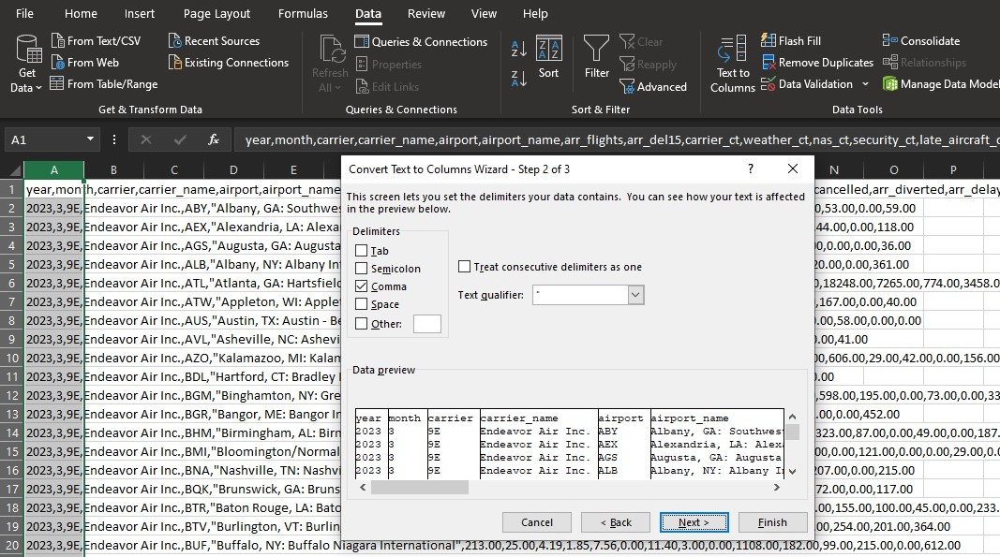
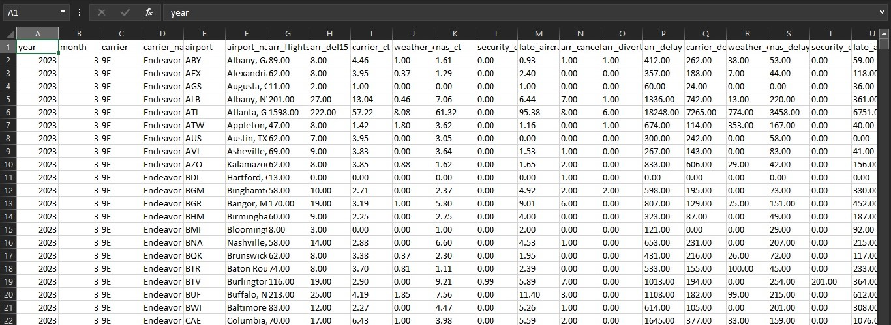
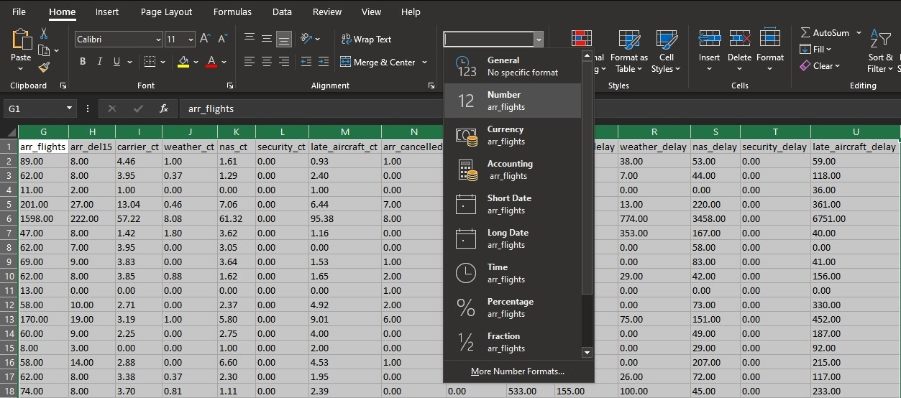
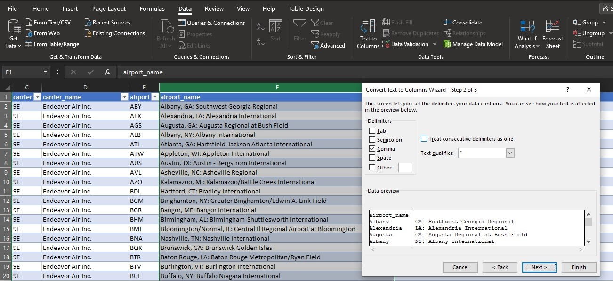
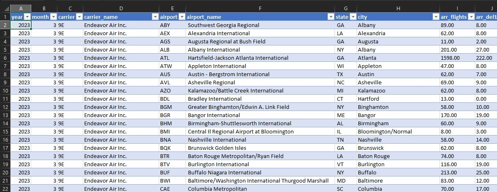
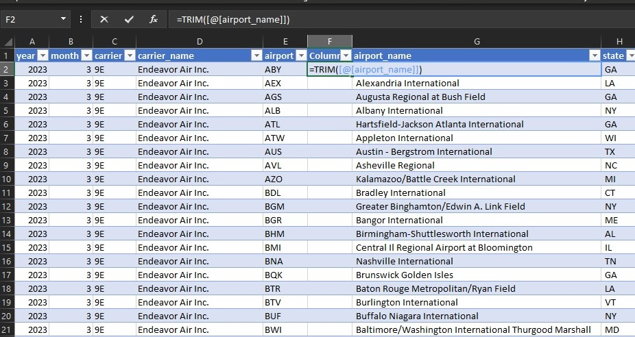
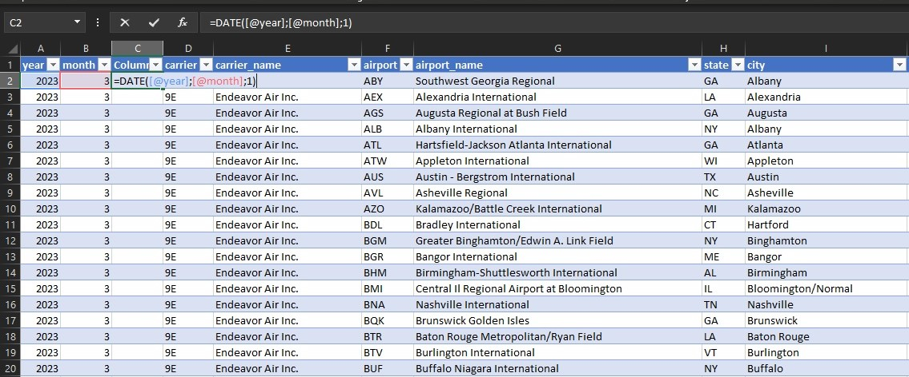
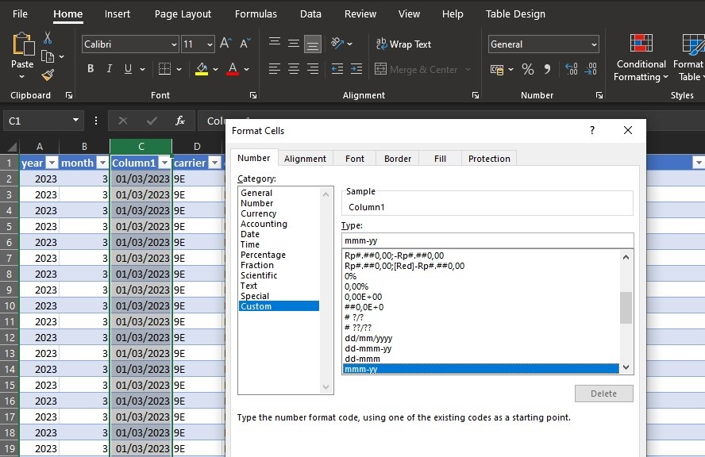
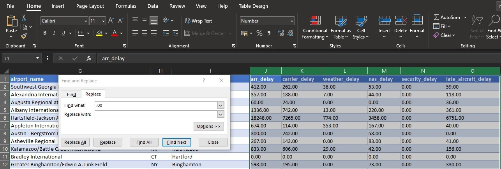

# Data Analaytics - Airline Delay Causes in US

The U.S. Department of Transportation's (DOT) Bureau of Transportation Statistics (BTS) tracks the on-time performance of domestic flights operated by large air carriers. Summary information on the number of on-time, delayed, canceled and diverted flights appears in DOT's monthly Air Travel Consumer Report, published about 30 days after the month's end, as well as in summary tables posted on this website. BTS began collecting details on the causes of flight delays in June 2003. Summary statistics and raw data are made available to the public at the time the Air Travel Consumer Report is released.

## Delay Problem

The airlines report the causes of delays in five broad categories:
1. Air Carrier : The cause of the cancellation or delay was due to circumstances within the airline's control (e.g. maintenance or crew problems, aircraft cleaning, baggage loading, fueling, etc.)
2. Extreme Weather : Significant meteorological conditions (actual or forecasted) that, in the judgment of the carrier, delays or prevents the operation of a flight such as tornado, blizzard or hurricane.
3. National Aviation System (NAS) : Delays and cancellations attributable to the national aviation system that refer to a broad set of conditions, such as non-extreme weather conditions, airport operations, heavy traffic volume, and air traffic control.
4. Late-arriving aircraft : A previous flight with same aircraft arrived late, causing the present flight to depart late.
5. Security : Delays or cancellations caused by evacuation of a terminal or concourse, re-boarding of aircraft because of security breach, inoperative screening equipment and/or long lines in excess of 29 minutes at screening areas.

(Source : [United States Department of Transportation](https://www.bts.dot.gov/)) 

### 1. Get Data
I used the [dataset](https://www.transtats.bts.gov/OT_Delay/OT_DelayCause1.asp) from June 2003 to March 2023 which is available in the dataset but we are free to use any period as long as the dataset is available.  

### 2. Data Cleansing
Data cleansing, also known as data cleaning or data scrubbing, refers to the process of identifying and correcting or removing errors, inconsistencies, and inaccuracies in a dataset. It is an essential step in data management and analysis to ensure that data is accurate, reliable, and consistent.
After I download the dataset, I will open the dataset (CSV file). I use microsoft excel 2021 to process the dataset. now we can see this dataset that we haven't processed yet. Now block coloum A and choose text to colums on the data tab.

now we will see the result of our table transform. There are 21 columns

We will change the data type containing number to number and string to text. and check for duplicate data

As we see in the airport_name column, there are state, city and airport names in one column. as an example : Albany, GA: Southwest Georgia Regional. we will separate this information into three sections. First we will separate the cities. by selecting text to columns on the Data tab

Do the same for cities and states

Now we have to remove empty spaces from the columns we have separated earlier. we will use the =TRIM formula on the empty columns

Don't forget to copy and paste as value. do the same for the state and city columns. After we separated one information into several columns, now we will combine two information into one column. as we see in column A (year) and B (month). we will combine the two information into one column by using function =Date(Year;Month;Date). However, because we don't know what date it is, we assume it is the first date.

change date format to mmm-yy in formal cells

Because we just want to analyze the flight delay case, I will delete the columns from arr_flight to arr_diverted. Keep in mind, if there is data that you don't know or don't need to include in your analysis, then it is better to delete it, this will make your analysis more consistent.

When we convert the dataset from CSV to excel the data in the arr_delay to late_aircraft_delay columns look like decimal numbers, but if you want to display fewer decimal numbers using decrease decimal on the number format tab it cannot be done. we can use another way by replacing the .00 numbers with empty numbers in the find and replace feature.

